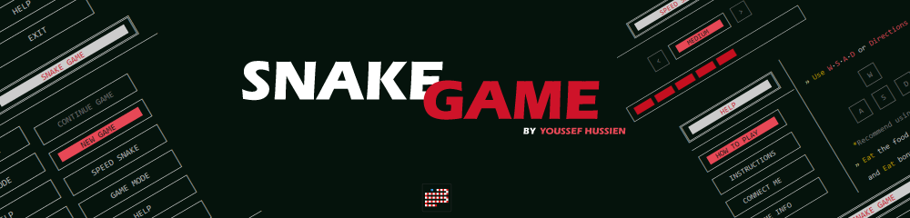
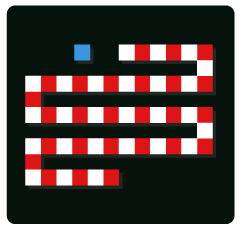
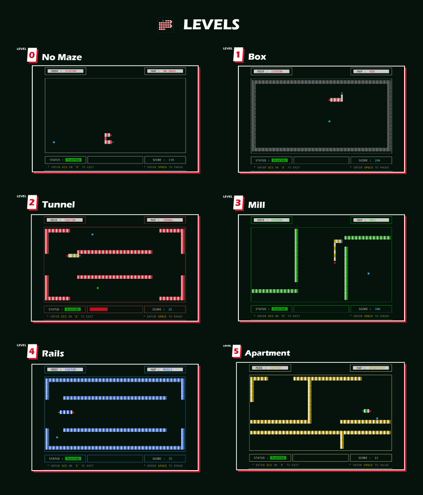
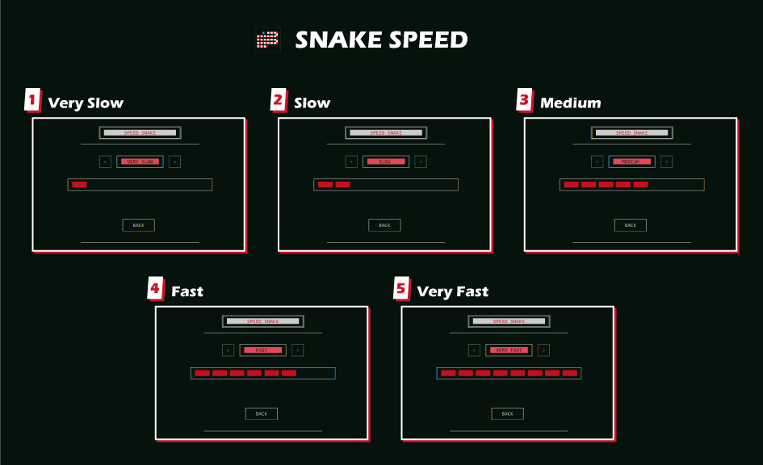
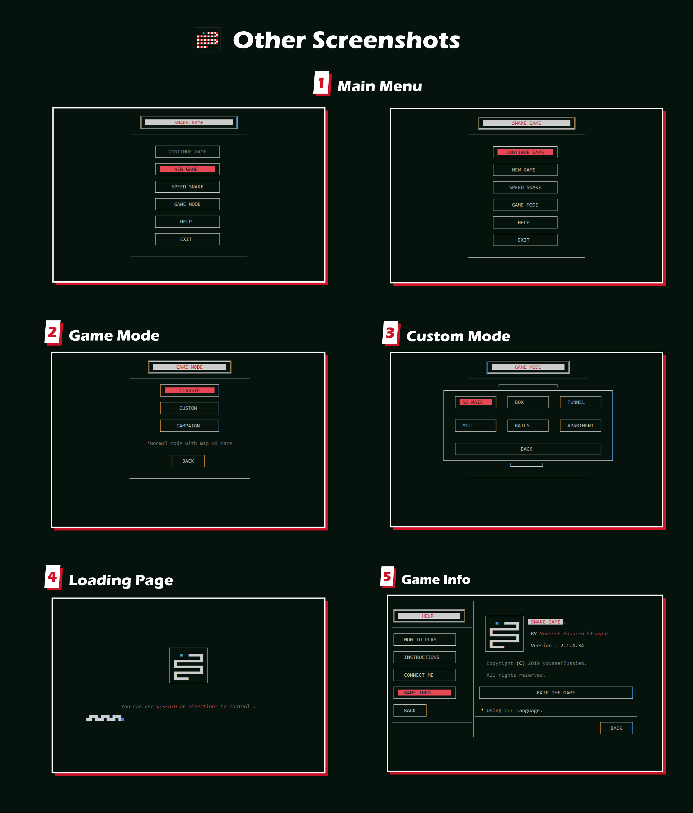

<h1 align="center">   Snake Game</h1><p align="center">Snake game is an <b>console application</b>, It is a complete simulation of the classic snake game. <br> Developed using <b>C++ language</b>.</p>


https://user-images.githubusercontent.com/53413129/124839820-37d72d00-df92-11eb-8d84-1a6c5400ff18.mp4


</b>

## Features

* **Different modes** to play:
  1. **Classic mode:** Normal mode with map No Maze
  2. **Custom mode:** Select one of the six maps to play
  3. **Campaign mode:** Campaign mode is a challenge consisting of 5 levels
* **Control the speed of the snake:** 8 levels of speed
* From time to time, a **bonus ball** appears that increases the score
* **The progress** and **current status** of the game are saved so that can refer to it again.

</b>

## How To Play

* Use `W∙S∙A∙D` or `arrow` to control the game.

  ```
         ┌───┐                      ┌───┐
         │ W │                      │ ^ │
         └───┘          OR          └───┘
   ┌───┐ ┌───┐ ┌───┐          ┌───┐ ┌───┐ ┌───┐
   │ A │ │ S │ │ D │          │ < │ │ v │ │ > │
   └───┘ └───┘ └───┘          └───┘ └───┘ └───┘
  ```

* **Eat the food** without colliding with any obstacles

* **Eat bonus food** quickly to score extra points.

* **Warnings:**

  * When you want to exit the game you have to going to **"EXIT"** in main menu and then **"SAVE | YES"** so that you can save your progress in the game.
  * You must not delete or modify the file associated with the game, which is named **"SnakeGame.DAT"** because deleting or modifying it may lead to the deletion of your progress in the game.

</b>

## Attention

This project was implemented in the first year of university (Faculty of Computer and Information), and accordingly the code is not clean (I was in the first year, man), I am proud that I finished this game at that time.

Maybe if I had the chance, I could refactoring this code again.

</b>

## Screenshots
| Levels |
| :--: |
|  |
| **Snake Speed** |
|  |
| **Other Screenshots** |
|  |

</b>

## Author

#### Youssef Hussien

> You can also follow my GitHub Profile to stay updated about my latest projects:
>
> [](https://github.com/youssef7ussien)

> If you liked the repo then kindly support it by giving it a star ⭐!
